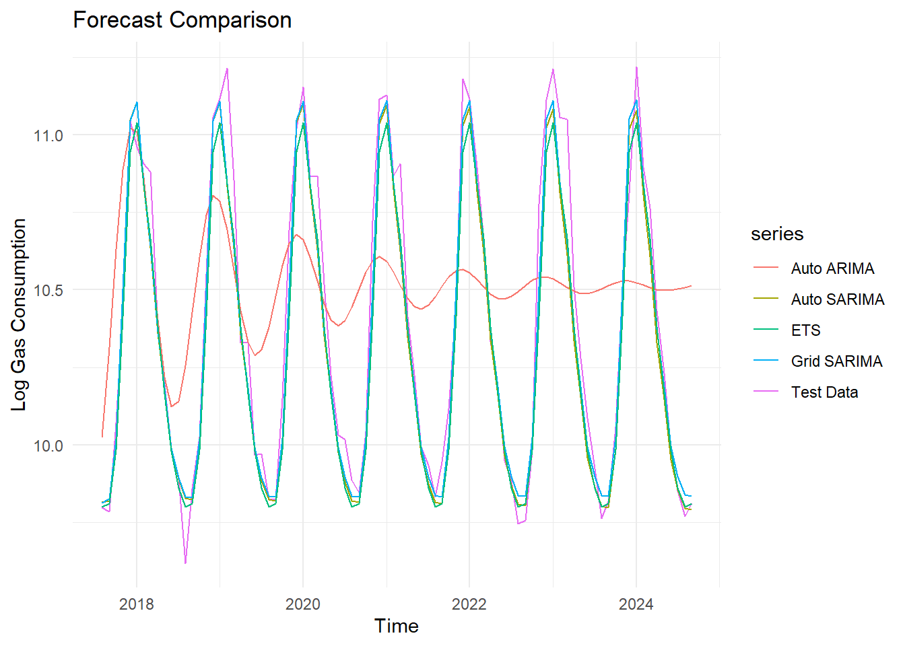

# 🔮 Gas Consumption Forecasting with Time Series Models

Forecasting monthly residential gas consumption in California using ARIMA, SARIMA, and ETS models in R.


---

## 📘 Table of Contents
- [Overview](#overview)
- [Technologies](#technologies)
- [Key Features](#key-features)
- [Dataset](#dataset)
- [Methodology](#methodology)
- [Forecast Accuracy](#forecast-accuracy)
- [Getting Started](#getting-started)
- [Next Steps](#next-steps)
- [Contact](#contact)

---

## 🧭 Overview

This project forecasts **monthly residential gas consumption in California** using time series models. It compares the performance of ARIMA, SARIMA, and ETS models and includes thorough diagnostics and residual analysis.

---

## 🧪 Technologies

- **Language:** R
- **Libraries:** `forecast`, `ggplot2`, `tseries`, `urca`, `TSA`, `FinTS`, `DescTools`, `fUnitRoots`, `patchwork`, `dplyr`
- **Models:** ARIMA, SARIMA, ETS (Exponential Smoothing)

---

## 🌟 Key Features

- 📈 STL decomposition of seasonal patterns
- 🧪 ADF, KPSS, McLeod-Li, and Ljung-Box residual diagnostics
- 🔍 ACF/PACF-guided model development
- 🔁 Log transformation, seasonal differencing
- 🔍 Model comparison using in-sample and out-of-sample accuracy

---

## 📊 Dataset

- **Source:** [U.S. EIA - California Natural Gas Consumption](https://www.eia.gov/dnav/ng/hist/n3010ca2m.htm)
- **Frequency:** Monthly
- **Period:** 1989–2024
- **Unit:** Million Cubic Feet
- **Data points:** 421
- **Preprocessing:** One missing value (Jan 2024) imputed using the historical average for January

---

## 🧠 Methodology

### 1. Preliminary Data Testing

- **Stationarity:** ADF and KPSS tests indicated the need for seasonal differencing
- **Distribution:** Skewness = 0.73, Kurtosis = -0.77; Q-Q plot showed deviation from normality (especially lower tail)
- **Variance behavior:** Log transformation applied to stabilize variance
- **Autocorrelation:** ACF and PACF plots showed strong seasonal effects

### 2. Exploratory Data Analysis

- Time series plots, histogram, Q-Q plot, STL decomposition

### 3. Model Building

- **Basic ARIMA** (non-seasonal)
- **Auto SARIMA** via `auto.arima()`
- **Grid SARIMA** selected as final model
- **ETS (M,N,A)** model used for benchmark comparison

### 4. Model Evaluation

- Forecast accuracy metrics: RMSE, MAE, MAPE
- Residual diagnostics: ACF1, Ljung-Box, McLeod-Li tests

---

## 📊 Forecast Accuracy

Forecast performance was evaluated on a holdout test set:

| Model                         | RMSE     | MAE      | MAPE    | Verdict                         |
|------------------------------|----------|----------|---------|----------------------------------|
| SARIMA(1,0,3)(0,1,1)[12]      | 0.0951   | 0.0694   | 0.655%  | ✅ Best model overall            |
| Auto SARIMA(2,0,1)(0,1,1)[12] | 0.0953   | 0.0696   | 0.656%  | Close second                    |
| Basic ARIMA(2,0,2)            | 0.1594   | 0.1197   | 1.13%   | ❌ Misses seasonality            |
| ETS(M,N,A)                   | 0.1016   | 0.0779   | 0.736%  | ❌ Residual autocorrelation present |

<p align="center">
  
</p>

<p align="center"><em>Figure: Forecast comparison across models on the test set</em></p>

---

## ⚙️ Getting Started

To run the project locally:

```r
# Install required libraries
install.packages(c("forecast", "tseries", "ggplot2", "urca", "DescTools",
                   "FinTS", "patchwork", "TSA", "fUnitRoots", "dplyr"))

# Load and run the script
source("gas_consumption_Ca.R")
